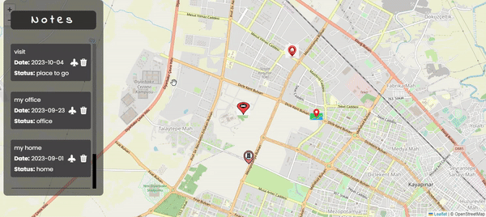

# NoteMap Project

This project allows users to add notes to their locations and view them on a map. Users can also edit and delete notes.

---

## Technologies Used

This project is developed using the following technologies:

- HTML
- CSS
- JavaScript
- Leaflet (Map Integration)

---

## About the Project

The NoteMap Project is a web application designed for various use cases such as marking travel destinations, adding important locations, or creating reminders. The project includes the following key features:

- **Location-Based Notes:** Users can add notes to the locations they click on the map.

- **Note Details:** Each note includes details such as descriptions, dates, and user-defined categories (parking, home, office, destination).

- **Dynamic Category Filtering:** The homepage can be used to filter notes by category, allowing users to better organize their notes.

- **Responsive Design:** The project follows responsive design principles to provide an excellent viewing experience on different devices.

---

## Homepage (index.html)

The homepage directs users to the project and can be used to add notes or view existing notes. The homepage also includes the map view.

---

## User Interface (main.js)

The `main.js` file contains JavaScript code that creates the user interface and is used to display notes. The homepage filters notes by category, while the note details page shows the details of the selected note.

---

## Helper Functions (helpers.js)

The `helpers.js` file includes auxiliary functions used in the project. For example, functions used to determine icons based on note type can be found in this file.

---

## Styling (style.css)

The `style.css` file defines the overall style of the project. This stylesheet controls the appearance of notes and the design of map components.

---

## Live Preview

To see the project live, you can [click here](https://note-map-js.netlify.app/).

---

## Screen

